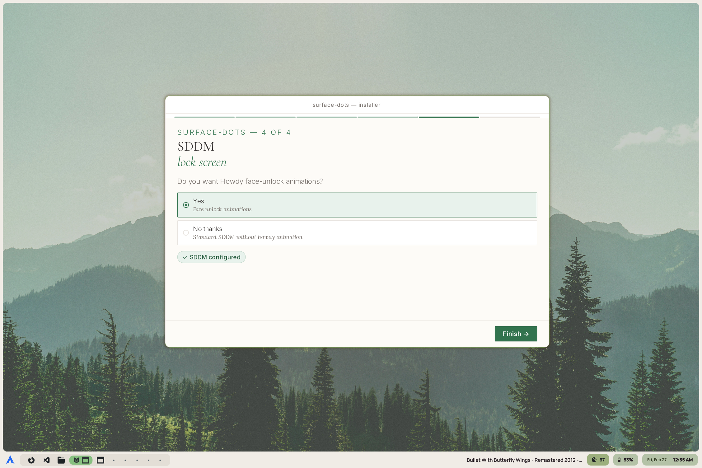

# surface-dots installer

The installer is a GUI app written in Rust + Tauri.

The source code is in `.source_codes/installer_src`.

<div align="center">
    
</div>

## How it works

The installer finds the repo root by walking up from the binary's location until it finds a directory containing both `.config/` and `sddm/` — so the binary has to stay inside the repo tree (drop it at the repo root after cloning).

Before writing anything it runs a **pre-flight** pass: it checks every source path a full install needs (blocking if the repo is incomplete) and warns about missing dependencies (`hyprctl`, `qs`, `pkexec`, nerd fonts, a polkit agent, …) without blocking. Every action is logged to `~/.cache/surface-dots-installer/manifest.log`.

**Path patching**

My configs had `/home/snes` hardcoded in places. The installer replaces every occurrence with the actual user's home during each file copy. It reads a file as text first; if that fails (binary), it copies raw. Permissions are preserved.

**Backups & rollback**

Before overwriting any config directory the installer backs up what's there to `<dir>/<name>.old` (clearing a stale backup first). If a step fails partway, it restores that component from its `.old` backup so nothing is left half-written.

**Hyprland (Lua)**

The config is Lua now (`hyprland.lua`, Hyprland 0.55+). Instead of patching a `.conf` line, the installer **regenerates** the `hl.monitor({...})` block(s) from the resolution/scale entered in the UI — one block for the primary monitor and, optionally, a second placed to the right automatically. `shader.lua` is copied alongside it.

The lock screen ships as themes under `hypr/hyprlock/` (`stellarium`, `pixel`), each with its own `hyprlock.conf` and `background.jpg`. The user picks one on the monitor screen; the installer copies that theme's conf plus its `background.jpg` to `~/.config/hypr/` (the conf references `~/.config/hypr/background.jpg`), alongside `hypridle.conf`.

**SDDM**

The SDDM step offers three choices : `None`, `Stellarium`, or `Pixel` (with an optional face-unlock variant). It copies the chosen theme into `/usr/share/sddm/themes/` and writes `/etc/sddm.conf.d/theme.conf` in one **idempotent** `pkexec bash -c` call, so the user sees a single polkit prompt and a re-run after a cancelled prompt can't leave a half state. It only fires on an explicit button press, and checks a polkit agent is running first (E-107) instead of failing opaquely.

**WebKit launch fix**

WebKit2GTK on Wayland renders a blank window or exits on launch for many users. The binary sets `WEBKIT_DISABLE_COMPOSITING_MODE` / `WEBKIT_DISABLE_GPU_PROCESS` / `WEBKIT_DISABLE_DMABUF_RENDERER` at startup.

**Quickshell**

Both bar layouts are in one config now, so the whole `.config/quickshell/` tree gets copied in one go and the picker only sets which bar loads first. That choice is written to `lib/usersettings.json` as a single `barStyle` key (`top` or `task`), and it can be changed later from the hub under Settings.

**Finish**

Reaching the final screen calls `finish_setup`. It sets `~/.config/hypr/wallpapers/default-dark.jpg` through `awww`, starting `awww-daemon` first if `awww query` reports it is not running, and sends a `Welcome to surface-dots` notification.

## If you want to build something like this

> _If you want to add something similar for your dotfiles, do not use this exact method. Its main objective is to serve as a personal learning experience for Rust and Tauri and I am basically recycling the front end from another project, it worked out fine but I wouldn't do it this way again. I don't think it's worth writing a dotfiles installer in tauri — maybe packaging a tauri frontend with bash scripts could work if you want a nice looking installer UI, but I still wouldn't recommend it._

## Testing

`sandbox.sh` (repo root) redirects `$HOME` to `/tmp/sandbox-home`, points the installer at your checkout via `SD_REPO_ROOT`, drops a fake `pkexec` on `PATH` so the SDDM step writes into `/tmp/sandbox-root`, sets `SD_SKIP_POLKIT_CHECK=1`, and launches the app. The frontend is static, so it runs with a plain `cargo run` (no `cargo-tauri` CLI needed). Unit + end-to-end tests live in `src-tauri/src/hypr.rs` and `paths.rs` — run them with `cargo test`.

#### Testing SDDM without touching your system

The fake `pkexec` intercepts the SDDM call and rewrites `/usr/` and `/etc/` paths to `/tmp/sandbox-root/`. The installer calls pkexec like this:

```
pkexec bash -c "mkdir -p /usr/share/sddm/themes && cp -r '/path/to/theme' /usr/share/sddm/themes/<name> && mkdir -p /etc/sddm.conf.d && printf '[Theme]\nCurrent=<name>\n' > /etc/sddm.conf.d/theme.conf"
```

## Notes

- **polkit agent**: the SDDM step uses `pkexec`. A polkit authentication agent must be running (e.g. `polkit-gnome`, `polkit-kde-agent`).
- **webkit2gtk**: Tauri on Linux requires `webkit2gtk-4.1`.

```bash
# Arch:
sudo pacman -S webkit2gtk-4.1
# Debian:
sudo apt install libwebkit2gtk-4.1-0
# Fedora:
sudo dnf install webkit2gtk4.1
```

---

## Error code reference

`src-tauri/src/errors.rs`:

All error codes are prime numbers, because I like prime numbers.

| Code | Meaning                                | Likely cause                                             |
| ---- | -------------------------------------- | -------------------------------------------------------- |
| 2    | Internal / unknown error               | Unexpected runtime condition                             |
| 3    | Repo root not found                    | Binary outside the repo tree (or `SD_REPO_ROOT` unset)   |
| 5    | Could not determine home directory     | `$HOME` not set                                          |
| 7    | Backup failed                          | No write permission on `~/.config`                       |
| 11   | Hyprland main config / assets failed   | Can't write `hyprland.lua`, `background.jpg`, `face.jpg` |
| 13   | _(legacy, unused — was `.conf` patch)_ | Replaced by Lua block generation (97)                    |
| 17   | Shaders copy failed                    | Missing `hypr/shaders/` in repo                          |
| 19   | Scripts copy failed                    | Missing `hypr/scripts/` or `screenshots/`                |
| 23   | Hyprlock / hypridle copy failed        | Missing conf files in repo                               |
| 29   | Kitty config copy failed               | Permissions or missing source                            |
| 31   | GTK theme copy failed                  | Permissions or missing tarballs                          |
| 37   | Kvantum config copy failed             | Permissions or missing source                            |
| 41   | Dunst config copy failed               | Permissions or missing source                            |
| 43   | Rofi config copy failed                | Permissions or missing source                            |
| 47   | Other utilities copy failed            | Permissions or a missing ags/waybar/etc. source          |
| 53   | Quickshell copy failed                 | Missing `quickshell/` subdirectory in repo               |
| 59   | SDDM theme source not found            | `sddm/themes/<pixel│stellarium>/` missing from repo      |
| 61   | SDDM pkexec step failed                | Polkit agent not running, or user cancelled the prompt   |
| 67   | _(legacy — folded into 61)_            | conf.d creation now part of the single pkexec call       |
| 71   | _(legacy — folded into 61)_            | default-theme write now part of the single pkexec call   |
| 73   | Invalid monitor resolution             | Expected `2880*1920` or `2880x1920`                      |
| 79   | Invalid scale value                    | Expected a decimal like `1.33`                           |
| 83   | Missing repo path (pre-flight)         | A file the install needs is absent from the repo         |
| 89   | `hyprland.lua` unreadable              | Missing/unreadable `hypr/hyprland.lua`                   |
| 97   | Monitor block generation failed        | No `hl.monitor(...)` found in `hyprland.lua`             |
| 101  | `shader.lua` copy failed               | Missing `hypr/shader.lua`, or write error                |
| 103  | Invalid secondary-monitor input        | Bad resolution/scale for the second monitor              |
| 107  | No polkit authentication agent         | SDDM step needs a running agent (e.g. polkit-gnome)      |
| 109  | Rollback failed                        | A backup could not be restored after a failed step       |
