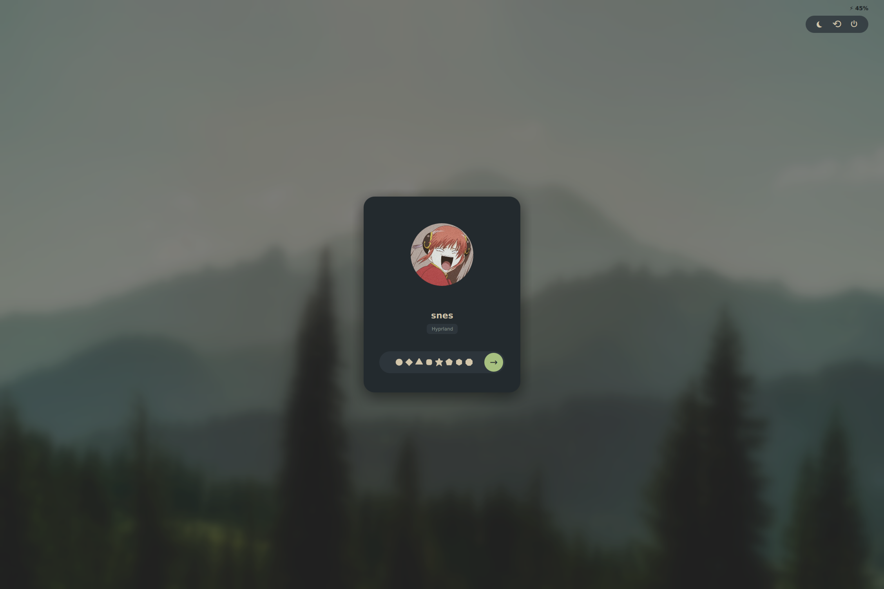
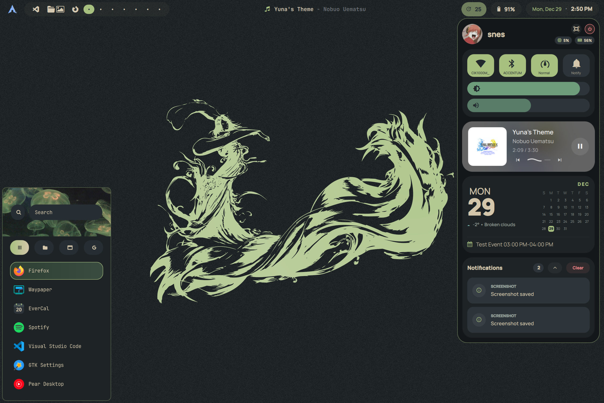
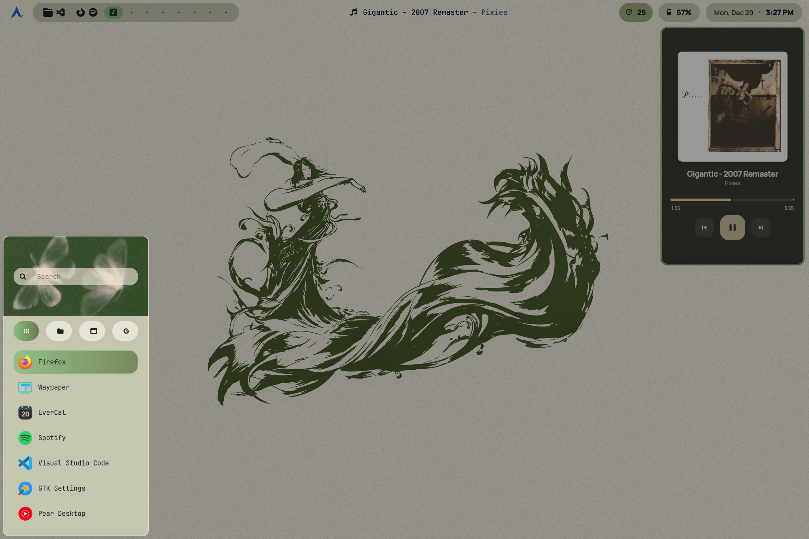
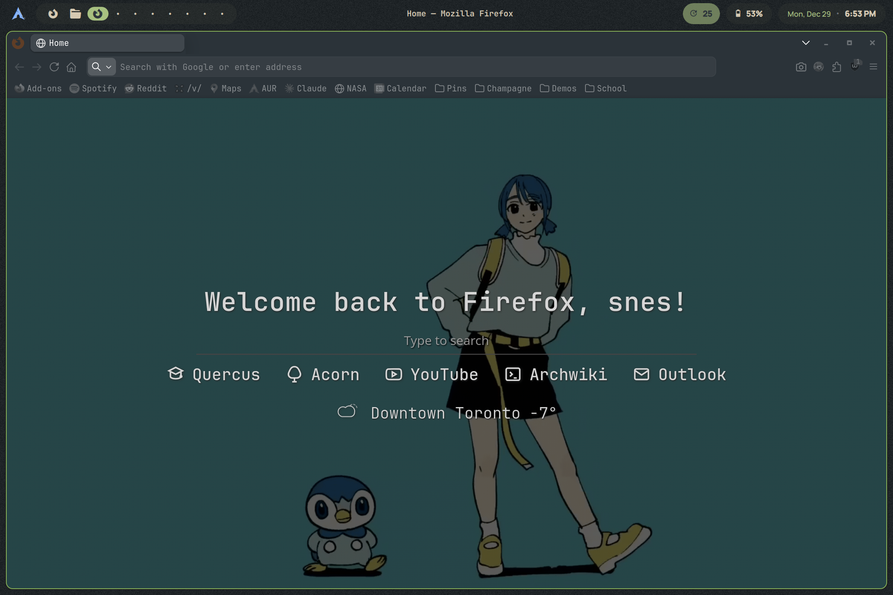
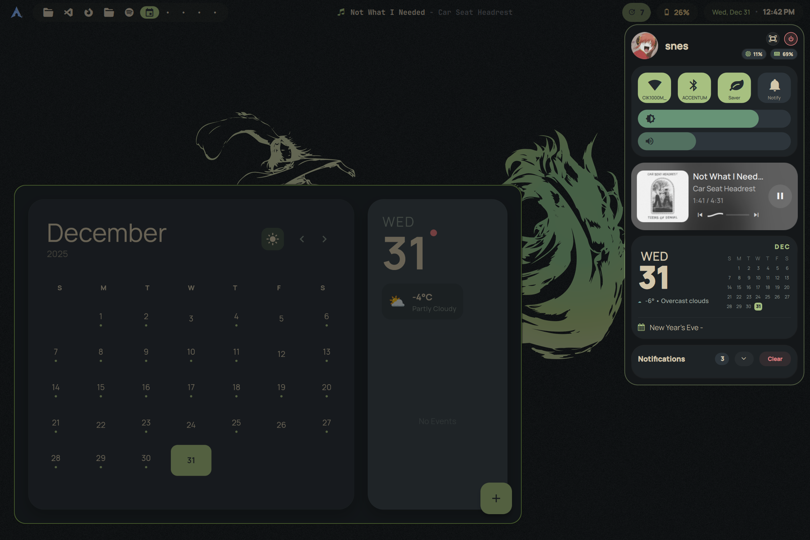

# surface-dots

Personal dotfiles + UI setup for my **Surface Laptop 4 (AMD)** running **Hyprland**. 
---

## Table of contents

- [Background](#background)
- [What’s in this repo](#whats-in-this-repo)
- [Dependencies](#dependencies)
- [Hyprland](#hyprland)
- [Quickshell Bar](#quickshell-bar) 
- [Quickshell Hub (`snes-hub`)](#quickshell-hub-snes-hub)
- [Google Calendar sync (vdirsyncer + khal)](#google-calendar-sync-vdirsyncer--khal)
- [Firefox custom new-tab](#firefox-custom-new-tab)
- [Surface-only features](#surface-only-features)
- [Credits & acknowledgements](#credits--acknowledgements)
- [Media sources](#media-sources)

---

## Background
I originally started the Hub in AGS, but eventually switched over to Quickshell. The AGS config is still included as an early prototype, it’s lighter and works, just not as feature-complete. Also, I built my own Flutter calendar (full app) and now playing (widget) simply because none of the existing ones looked quite right to me.
ss7
---
<div align="center">
  
  
  <p><i>SDDM: Lock Screen & Login Screen (hyprlock also looks just like this + with media information if playing when locked)</i></p>
  
  <br/>

  
  
  <p><i>Dark Mode & Light Mode (Hub + Rofi + Now-playing)</i></p>

  <br/>

  
  
  <p><i>Firefox Custom Start Page + EverCal Dark mode</i></p>
</div>

## What’s in this repo
This is the structure I’m aiming for (some parts are “supporting configs”):
- `.config/`
- `hypr/` — Hyprland configuration (updated for v 0.53).
- `quickshell/` — main hub UI.
- `ags/` — early, lighter hub prototype.
- `rofi/`, `mako/`, `khal/`, `kitty/`, `gtk-3.0/`, `vdirsyncer/` — supporting configs.
- `firefox/` — custom new-tab setup.
- `now_playing/` — Flutter project for the now-playing widget.
- `sddm/` — SDDM theme.
- `media/` — wallpapers and screenshots.

---
## Dependencies

<table>
<tr>
<td valign="top">

### Core & System
* Hyprland
* hypridle
* hyprlock
* hyprland-plugins
* xdg-utils
* xdg-desktop-portal-hyprland
* xdg-desktop-portal-kde
* xdg-desktop-portal-gtk
* polkit-gnome
* sddm
* networkmanager
* bluez, blueman

</td>
<td valign="top">

### UI & Theming
* mako
* swww
* waypaper
* rofi
* kitty
* firefox
* colorreload-gtk-module
* Everforest-Dark-theme
* EVerforest-Light-theme
* qt6ct
* papirus-icon-theme
* ttf-manrope
* ttf-nerd-fonts-symbols

</td>
<td valign="top">

### Utilities
* grim, slurp, swappy, grimblast
* pamixer, pipewire-pulse or pulseaudio
* playerctl
* brightnessctl
* quickshell
* vdirsyncer
* khal
* [EverCal](https://github.com/snes19xx/EverCal)
* xdg-utils
* curl, jq
* flutter, dart
* linux-surface tools (Linux-surface only)

</td>
</tr>
</table>

---

## Hyprland
Main config is for Hyprland v0.53: `~/.config/hypr/hyprland.conf`
OLd Config at `~/.config/hypr/hyprland_OLD.conf`

### Keybindings
#### Apps
- `SUPER + Q` → terminal (`kitty`)
- `SUPER + E` → file manager (`thunar`)
- `SUPER + R` → rofi launcher script
- `SUPER + B` → firefox

#### Window actions
- `SUPER + X` → kill active window
- `SUPER + ALT + F` → toggle floating (simple)
- `SUPER + F` → toggle floating **and** set size `900x600` + center
- `SUPER + M` → fullscreen
- `SUPER + P` → pseudotile
- `SUPER + UP` → togglesplit
- `SUPER + DOWN` → togglesplit

#### Exit
- `SUPER + ALT + F4` → exit Hyprland

#### Focus (arrow keys)
- `SUPER + Left/Right` → move focus horizontally
- `SUPER + UP/Down`  → move focus vertically

#### Workspaces
- `SUPER + 1..0` → workspace `1..10`
- `SUPER + SHIFT + 1..0` → move active window to workspace `1..10`
- `SUPER + mouse wheel` → next/prev workspace

#### Scratchpad (“special workspace”)
- `SUPER + S` → toggle special workspace `magic`
- `SUPER + SHIFT + S` → move active window to `special:magic`

#### Mouse (window move/resize)
- `SUPER + LMB` → move window
- `SUPER + RMB` → resize window

#### Media / special keys
- Brightness keys → `brightnesscontrol.sh` (up/down)
- Volume keys → `audiocontrol.sh` (up/down/mute)
- Play key → `mediacontrol.sh`

#### Screenshots
- `Print` → screenshot script mode `s`
- `SUPER + Print` → mode `p`
- `SUPER + SHIFT + Print` → mode `sf`
- `SUPER + O` → mode `m`

### Window rules

There are targeted rules for:

- `kitty` (float + size `500x300` + rounding `10` + opacity `0.9`)
- `blueman-manager` (float + size `500x300` + rounding + opacity)
- `nm-connection-editor` (float + size `500x600` + rounding + opacity + border color)
- `com.snes.evercal` (float + size `900x600` + rounding `20`)

- Portals + auth prompts are tagged `portal-ui` (gtk/kde/hyprland portals, polkit agents, pinentry, ssh-askpass)
  - then enforced as: float + center + rounding `10` + size `1100x750` + dim_around + opacity `0.95`

- `thunar`:
  - always opacity `0.9`
  - if floating: size `900x600` + center

- Generic floating dialogs:
  - modal windows: float + center + rounding `10`
  - common titles (Open File / Save As / Rename / etc.) forced to float + center
  - some titles get sizing rules + dim_around rules

- Visual rule for ALL floating windows:
  - `border_color rgb(87b158)`

- `org.gnome.FileRoller` (float + size `500x350` + rounding + border color)
- `com.snes.nowplaying` widget (float + pinned + border + animation + fixed position + opacity)

### Layer rules 
- `rofi` namespace: ignore_alpha `0.9` + slide-left animation + dim_around
- `quickshell` namespace: slide-top animation + dim_around

---

## Quickshell Bar 

The bar uses an Arch glyph icon (top left) as the launcher button:

- Left click: launches rofi, choosing a different launcher script depending on the current theme mode.
- Right click: toggles the bar’s isDarkMode and calls a theme script:
```bash
bash ~/config/quickshell/snes-hub/bar/theme-mode.sh dark|light
```

### Workspaces

Clicking a workspace pill runs: `- hyprctl dispatch workspace <id>`

### Updates
Updates are polled with:
``` bash
checkupdates 2>/dev/null | wc -l
```
and clicking it simnply runs
``` bash
kitty -e sudo pacman -Syu
```

### Date and Clock
- Pressing the clock triggers a requestHubToggle() signal (used to open/close the hub).
- Esc closes the hub (or clicking anywhere outside it).

## Quickshell Hub (`snes-hub`)
- The hub window is an overlay (wlr-layershell) and is designed to get out of your way quickly:
- Organized into reusable components under the Quickshell project, making it straightforward to add/remove cards or re-skin pieces without rewriting the whole hub.
- If you want a lightweight fallback, use the early **AGS** version in `.config/ags/` (works, but fewer features).

### Components
#### Header
- Profile icon,username + RAM/CPU usage chips.
- Power button that launches the Rofi power menu.
- Screenshot button (runs the capture script and then closes the hub).

#### Buttons and Sliders
- Wi‑Fi toggle + SSID readout (right‑click opens the Wi‑Fi Rofi menu).
- Bluetooth toggle + connected device status.
- Surface performance profile button (cycle modes via `surface profile`).
- DND toggle (mako).
- Volume + brightness sliders (pactl + brightnessctl).

#### Media card (MPRIS)
- The hub includes an MPRIS-powered media card:
- Clicking the media card launches the external now-playing widget and then toggles the hub off.
- It tracks metadata changes and resets its internal timing state when tracks change. It's still finicky with some browser contents like youtube videos
- Only appears when something is playing
- Summons Now playing widget on click

#### Now Playing (Flutter)
- This is a separate Flutter desktop widget (class rules are handled in Hyprland).
- Resizable is disabled (setResizable(false) is used)
- Esc closes the widget 
- Generates theme colors from album art using palette_generator

#### Calendar, Weather and Events
##### Google Calendar sync (vdirsyncer + khal)
###### Setup
Recommended approach (avoids system Python packaging issues):
``` bash
sudo pacman -S --needed python-pipx
```
```python
pipx install "vdirsyncer[google]"
```

- If you have both a system and pipx vdirsyncer, remove the system one and make sure PATH prefers ~/.local/bin.

###### Config
Create folders:
```bash
mkdir -p ~/.config/vdirsyncer/status ~/.config/vdirsyncer/tokens
mkdir -p ~/.local/share/vdirsyncer/calendars
```
Example vdirsyncer config uses:
`token_file = "~/.config/vdirsyncer/tokens/google_calendar"`
`type = "google_calendar"`
`client_id / client_secret` from Google Cloud OAuth
`~/.local/share/vdirsyncer/calendars/*` - Khal reads .ics files from here

###### Note:
- You must enable CalDAV API in Google Cloud (not only the “Google Calendar API”).
- If OAuth consent is in Testing mode, add yourself as a “Test user”.
- If you get “token obtained but Not Found”, enable calendars at: https://calendar.google.com/calendar/syncselect

###### Run + test
```bash
vdirsyncer discover
vdirsyncer sync
khal list now 7d
```
#### Notifications
- Clicking dismisses.
- Uses **mako** (`makoctl`) as the notification backend.
- Contracted by default when the media player card is active, but can be expanded via the expand button.


## Firefox custom new-tab

- Custom Firefox start page: https://github.com/snes19xx/custom-firefox-start
- usercss (Also in this repo): https://github.com/snes19xx/firefox-customizations

Firefox doesn't really want you to use local html as a new tab page so 
- Move autoconfig.js to Firefox defaults/pref/ (e.g. /usr/lib/firefox/defaults/pref/)
- Edit mozilla.cfg (repo path: .config/firefox/mozilla.cfg) and set your file path
- Move mozilla.cfg to the Firefox install directory root (e.g. /usr/lib/firefox/)

## Surface-only features
- Some features (like the performance toggle) are Surface-specific and depend on the linux-surface tooling.
- To adapt this setup to other hardware:
- Replace Surface-specific calls in `ButtonsSlidersCard.qml` like: 
```bash
sudo surface profile get
sudo surface profile set <mode>
```
- Swap in your own governor/performance scripts.

## Credits & acknowledgements
- [Everforest-GTK-Theme](https://github.com/Fausto-Korpsvart/Everforest-GTK-Theme) by Fausto-Korpsvart
- Rofi themes loosely based on @adi1090x's [type 7](https://github.com/adi1090x/rofi/blob/master/previews/launchers/type-7/5.png)
- `Pixeldots.qml` in sddm theme based on @mahaveergurjar's [Pixeldots](https://github.com/mahaveergurjar/sddm/tree/pixel)
- Colors: https://github.com/sainnhe/everforest
- linux-surface project: https://github.com/linux-surface/linux-surface
- Thorium: https://thorium.rocks/

## Media sources
- Piplup gif: animation by [coal_owl](https://www.instagram.com/coal_owl/?hl=en) [full video](https://www.youtube.com/watch?v=bm0nLJuRNbw&list=RDbm0nLJuRNbw)
- 14.jpg: Photo by fffunction studio on [Unsplash](https://unsplash.com/photos/green-trees-near-mountains-during-daytime-IrWgzQ_Y_zg)
- 15.jpg: Photo by Brian McGowan on [Unsplash](https://unsplash.com/photos/astronaut-in-white-suit-in-grayscale-photography-I0fDR8xtApA)
- luci_light.jpg: https://www.amazon.ca/Art-Fire-Emblem-Awakening-ebook/dp/B01J1XIC2O
- Final Fantasy X logo: by [Yoshitaka Amano](https://en.yoshitaka-amano.com/#/)
- All Rofi pictures were pulled from Pinterest; I don’t know the original owners.

