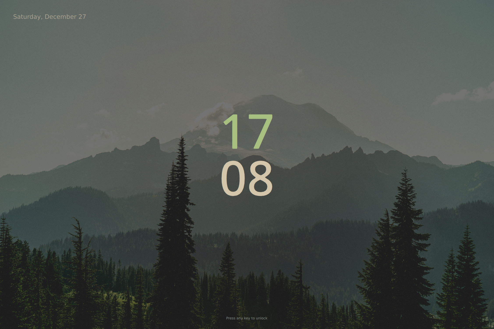
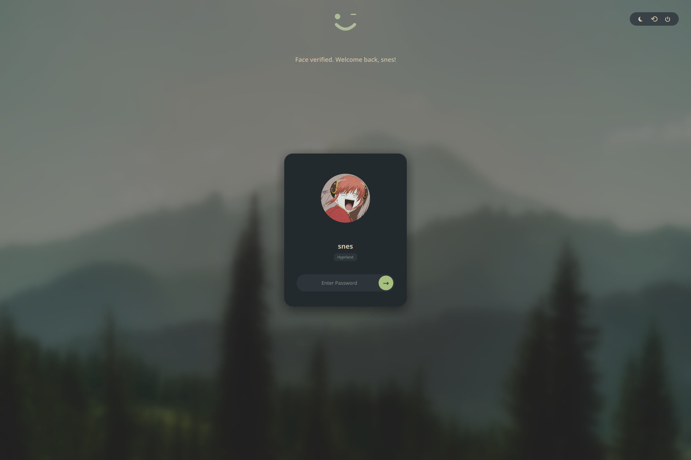
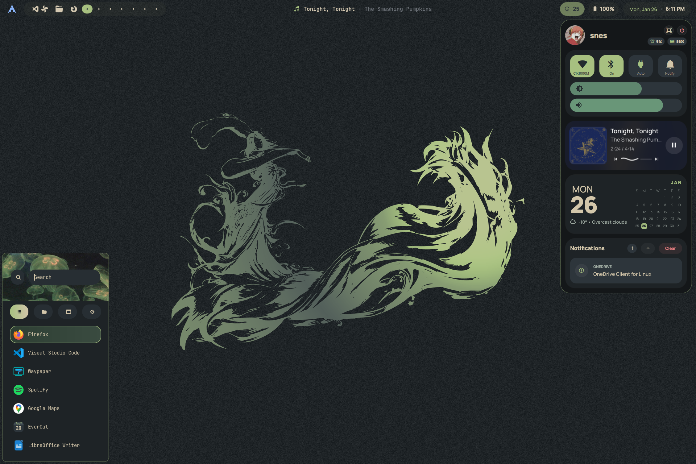
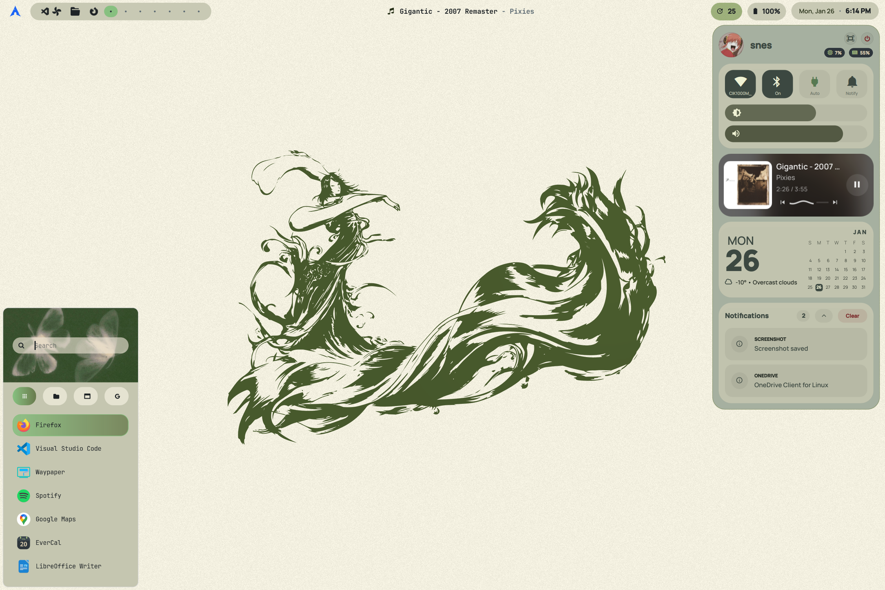
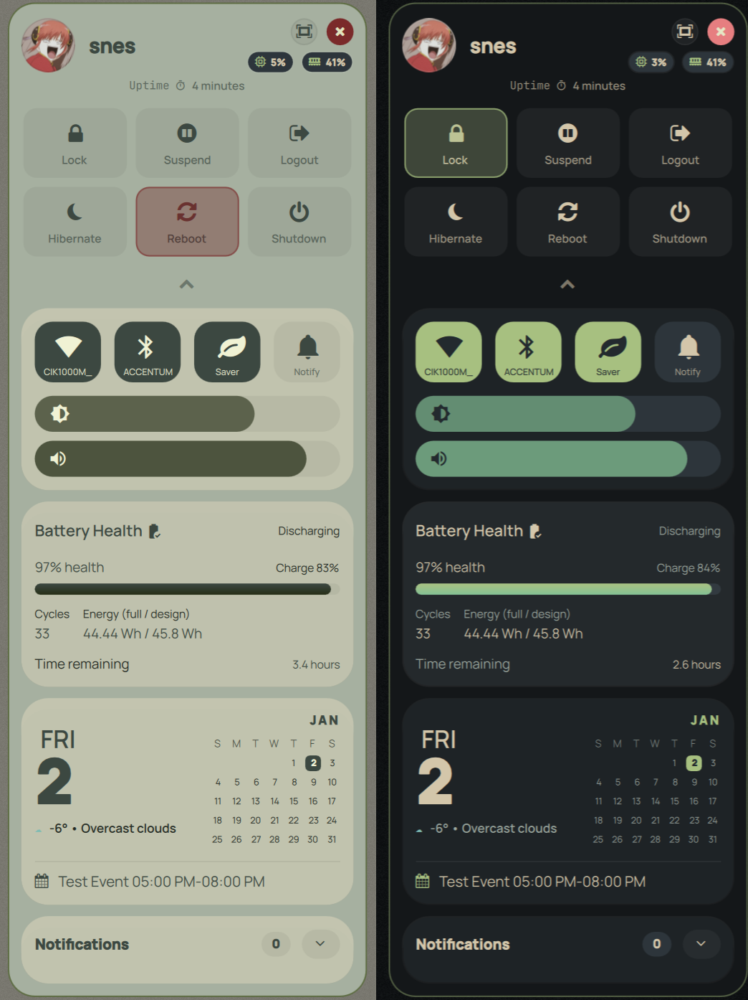

# surface-dots

Personal dotfiles + UI setup for my **Surface Laptop 4 (AMD)** running **Hyprland**.
Also, please check my calendar app: [Evercal](https://github.com/snes19xx/EverCal)

---

## Table of contents

- [Dependencies](#dependencies)
- [Hyprland](#hyprland)
- [Reading Mode](#reading-mode)
- [CRT Mode](#crt-mode)
- [Quickshell Bar](#quickshell-bar)
- [Quickshell Hub (`snes-hub`)](#quickshell-hub-snes-hub)
- [Google Calendar sync (vdirsyncer + khal)](#google-calendar-sync-vdirsyncer--khal)
- [Power menu](#power-menu)
- [Wifi menu](#wifi-menu)
- [Pixel sddm theme](#pixel-sddm-theme)
- [Firefox custom new-tab](#firefox-custom-new-tab)
- [Surface-only features](#surface-only-features)
- [Credits & acknowledgements](#credits--acknowledgements)
- [Media sources](#media-sources)

---

<div align="center">
  
  
  <p><i>SDDM: Lock Screen & Login Screen (hyprlock also looks just like this + with media information if playing when locked)</i></p>
  
  <br/>

  
  
  <p><i>Dark Mode & Light Mode (Hub + Rofi)</i></p>

  <br/>

  
  
  <p><i>Reading mode & Various other apps</i></p>
</div>

## Dependencies

<table>
<tr>
<td valign="top">

### Core & System

- Hyprland
- hypridle
- hyprlock
- hyprshade
- hyprland-plugins
- xdg-utils
- xdg-desktop-portal-hyprland
- xdg-desktop-portal-kde
- xdg-desktop-portal-gtk
- polkit-gnome
- sddm
- networkmanager
- bluez, blueman

</td>
<td valign="top">

### UI & Theming

- mako
- swww
- waypaper
- rofi
- kitty
- firefox
- colorreload-gtk-module
- Everforest-Dark-theme
- EVerforest-Light-theme
- qt6ct
- kvantum
- papirus-icon-theme
- ttf-manrope
- ttf-nerd-fonts-symbols
- inter-font

</td>
<td valign="top">

### Utilities

- grim, slurp, swappy, grimblast
- pamixer, pipewire-pulse or pulseaudio
- playerctl
- brightnessctl
- quickshell
- vdirsyncer
- khal
- [EverCal](https://github.com/snes19xx/EverCal)
- xdg-utils
- curl, jq
- flutter, dart
- linux-surface tools (Linux-surface only)
- auto-cpufreq

</td>
</tr>
</table>

---

> [!CAUTION]
> Layout geometry is hardcoded for 3:2 high-resolution display. Deviation in aspect ratio or pixel density will result in misalignment or things looking too big. Please reconfigure values accordingly.

## Hyprland

Main config is for Hyprland v0.53: `~/.config/hypr/hyprland.conf`
Old Config at `~/.config/hypr/hyprland_OLD.conf`

<details>
  <summary><strong>Keybindings</strong></summary>

### Apps

- `SUPER + Q` → terminal (`kitty`)
- `SUPER + E` → file manager (`thunar`)
- `SUPER + R` → rofi launcher script
- `SUPER + B` → firefox
- `SUPER + D` → reading mode

### Window actions

- `SUPER + SPACE` → toggle hub on or off
- `SUPER + X` → kill active window
- `SUPER + ALT + F` → toggle floating (simple)
- `SUPER + F` → toggle floating **and** set size `900x600` + center
- `SUPER + M` → fullscreen
- `SUPER + P` → pseudotile
- `SUPER + UP` → togglesplit
- `SUPER + DOWN` → togglesplit

### Exit

- `ALT + F4` → Power menu
- `SUPER + ALT + F4` → exit Hyprland

### Focus (arrow keys)

- `SUPER + Left/Right` → move focus horizontally
- `SUPER + UP/Down` → move focus vertically

### Workspaces

- `SUPER + 1..0` → workspace `1..10`
- `SUPER + SHIFT + 1..0` → move active window to workspace `1..10`
- `SUPER + mouse wheel` → next/prev workspace

### Scratchpad (“special workspace”)

- `SUPER + S` → toggle special workspace `magic`
- `SUPER + SHIFT + S` → move active window to `special:magic`

### Mouse (window move/resize)

- `SUPER + LMB` → move window
- `SUPER + RMB` → resize window

### Media / special keys

- Brightness keys → `brightnesscontrol.sh` (up/down)
- Volume keys → `audiocontrol.sh` (up/down/mute)
- Play key → `mediacontrol.sh`

### Screenshots

- `Print` → screenshot script mode `s`
- `SUPER + Print` → mode `p`
- `SUPER + SHIFT + Print` → mode `sf`
- `SUPER + O` → mode `m`

</details>

---

## Reading Mode

A shader-based reading mode to mimic an e-ink reader.

- Toggle with `SUPER + D` or `~/.config/hypr/shaders/reading_mode.sh`
- Automatically disables animations, shadows, and blur
- Custom GLSL shader with e-ink-like color reproduction
- Warm cream paper tone
- Soft charcoal blacks for reduced contrast
- Fine paper grain -like texture
- Shader located at `~/.config/hypr/shaders/reading_mode.glsl`
- Uses [hyprshade](https://github.com/loqusion/hyprshade)

## CRT Mode

A shader-based CRT mode to mimic a crt screen

- Generally meant for emulation, retro aesthetics, old 4:3 content
- Uses rofi and waybar for simple retro look
- Toggle on or off with `SUPER + C`
- Please use my script to dctivate/deactivate on or off OR you must disable Hyprland's damage tracking: `"keyword debug:damage_tracking 0"`
- Shader located at `~/config/hypr/shaders/crt_mode.glsl`

Features: Curved screen distortion, subtle color fringing, horizontal scanlines with brightness-dependent phosphor bleed, vertical shadow mask to emulate phosphor stripes etc.

I’ve also included a complementary Python image filter that applies CRT-style effects to images.

- Script located at `utilities/crt_gen.py`

## Quickshell Bar

The bar uses an Arch glyph icon (top left) as the launcher button:

- Left click: launches rofi, choosing a different launcher script depending on the current theme mode.
- Right click: toggles the bar’s isDarkMode and calls a theme script:

```bash
bash ~/config/quickshell/snes-hub/bar/theme-mode.sh dark|light
```

### Workspaces

Clicking a workspace pill runs: `- hyprctl dispatch workspace <id>`

### Updates

Updates are shown using a poller, but it won’t run checkupdates while pacman is busy (to avoid lock-related crashes). When the pacman lock file exists, the bar displays the last cached update count instead. Polled with:

```bash
if [ -e /var/lib/pacman/db.lck ]; then
  cat /tmp/qs_updates_count 2>/dev/null || echo 0
else
  checkupdates 2>/dev/null | wc -l | tee /tmp/qs_updates_count
fi

```

Clicking the updates pill runs:

```bash
kitty -e bash -lc "sudo pacman -Syu"
```

### Date and Clock

- Pressing the clock triggers a requestHubToggle() signal (used to open/close the hub).
- Esc closes the hub (or clicking anywhere outside it).

## Quickshell Hub (`snes-hub`)

- Toggled by clicking the date/clock module in the bar or SUPER+SPACE keybinding through hyprland
- The hub window is an overlay (wlr-layershell) and is designed to get out of your way quickly:
- Organized into reusable components, making it straightforward to add/remove cards or re-skin pieces without rewriting the whole hub.
- If you want a lightweight fallback, use the early **AGS** version in `.config/ags/` (works, but fewer features).

### Components


    
#### Header
- Profile icon,username + RAM/CPU usage chips.
- Screenshot button (runs the capture script and then closes the hub).
- Power button

#### Power options

- Compact power grid that expands (click the power button or press `p` key) _inside the header_ (no extra window):
- Keyboard navigation: **Arrow keys / Tab** to move, **Enter** to trigger, **Esc** to close.

#### Buttons and Sliders

- Wi‑Fi toggle + SSID readout (right‑click opens the Wi‑Fi Rofi menu).
- Bluetooth toggle + connected device status.
- Performance profile button (cycle modes via `auto-cpufreq`, right click toggles battery health card).
- DND toggle (mako).
- Volume + brightness sliders (pactl + brightnessctl).

#### Battery health

- Polls: `upower -i /org/freedesktop/UPower/devices/battery_BAT1`
- Shows: **Health** (capacity %) + **current charge %**, **Charge cycles**, **Energy (full / design)**, **Time remaining** (to full/empty when available), **State** (charging/discharging/fully-charged)

> [!NOTE]
> If your battery isn’t `battery_BAT1`, swap the device path in `BatteryHealthCard.qml` to match your system.

#### Media card (MPRIS)

- The hub includes an MPRIS-powered media card:
- Clicking the media card launches the external now-playing widget and then toggles the hub off.
- It tracks metadata changes and resets its internal timing state when tracks change. It's still finicky with some browser contents like youtube videos
- Only appears when something is playing
- Summons Now playing widget on click

#### Now Playing (Flutter)

- This is a separate Flutter desktop widget (class rules are handled in Hyprland).
- Resizable is disabled (setResizable(false) is used)
- Esc closes the widget
- Generates theme colors from album art using palette_generator

#### Calendar, Weather and Events

A simple calendar with weather (json based script and events from my google calendar using khal+ vdirsyncer.

<details>
<summary><strong>Google Calendar sync (vdirsyncer + khal)</strong></summary>

Recommended approach (avoids system Python packaging issues):

```bash
sudo pacman -S --needed python-pipx
```

```python
pipx install "vdirsyncer[google]"
```

- If you have both a system and pipx vdirsyncer, remove the system one and make sure PATH prefers ~/.local/bin.

###### Config

Create folders:

```bash
mkdir -p ~/.config/vdirsyncer/status ~/.config/vdirsyncer/tokens
mkdir -p ~/.local/share/vdirsyncer/calendars
```

Example vdirsyncer config uses:
`token_file = "~/.config/vdirsyncer/tokens/google_calendar"`
`type = "google_calendar"`
`client_id / client_secret` from Google Cloud OAuth
`~/.local/share/vdirsyncer/calendars/*` - Khal reads .ics files from here

###### Note:

- You must enable CalDAV API in Google Cloud (not only the “Google Calendar API”).
- If OAuth consent is in Testing mode, add yourself as a “Test user”.
- If you get “token obtained but Not Found”, enable calendars at: https://calendar.google.com/calendar/syncselect

###### Run + test

```bash
vdirsyncer discover
vdirsyncer sync
khal list now 7d
```

</details>

#### Notifications

- Clicking dismisses.
- Uses **mako** (`makoctl`) as the notification backend.
- Contracted by default when the media player card is active, but can be expanded via the expand button.

## Power menu

<div align="center">
  <table>
    <tr>
      <td>
        
      </td>
      <td>
        
      </td>
    </tr>
  </table>
</div>

wlr-layershell power menu overlay (separate from the hub header menu). Toggled with ALT+F4
**Run**

```bash
quickshell -p ~/.config/quickshell/snes-hub/bar/PowerMenu.qml
```

## Wifi menu

Standalone network manager applet located at lib/WifiMenu.qml. With both (light/dark) theme.

- Trigger: Right-click the Wi-Fi button in the Hub.
- or run: `quickshell -p ~/.config/quickshell/snes-hub/lib/Wifimenu.qml`

> [!WARNING]
> You cannot connect to enterprise access points yet, I haven't had the time to fix it yet

## Pixel sddm theme

- Required (I recommend installing `qt5-graphicaleffects qt5-quickcontrols2 qt5-svg` too if it keeps giving error):

```bash
sudo pacman -S qt6-5compat qt6-svg qqc2-desktop-style inter-font ttf-nerd-fonts-symbols
```

- There's an alternative version with windows hello like animations for howdy facial recognition at `sddm/themes/pixel/.withhowdy_effects`
- To install:
  - move the contents of sddm/theme folder to `/usr/share/sddm/themes/` (create the dir if it doesn't exist yet)
  - Set "pixel" as the current theme by creating a config file in `/etc/sddm.conf.d/`:
  - make sure the directory exists:

  ```bash
  sudo mkdir -p /etc/sddm.conf.d
  ```

  - then create the config file:

  ```bash
  echo -e "[Theme]\nCurrent=pixel" | sudo tee /etc/sddm.conf.d/theme.conf
  ```

## Firefox custom new-tab

- Custom Firefox start page: https://github.com/snes19xx/custom-firefox-start
- usercss (Also in this repo): https://github.com/snes19xx/firefox-customizations

Firefox doesn't really want you to use local html as a new tab page so

- Move autoconfig.js to Firefox defaults/pref/ (e.g. /usr/lib/firefox/defaults/pref/)
- Edit mozilla.cfg (repo path: .config/firefox/mozilla.cfg) and set your file path
- Move mozilla.cfg to the Firefox install directory root (e.g. /usr/lib/firefox/)

## Credits & acknowledgements

- [Everforest-GTK-Theme](https://github.com/Fausto-Korpsvart/Everforest-GTK-Theme) by Fausto-Korpsvart
- Rofi themes loosely based on @adi1090x's [type 7](https://github.com/adi1090x/rofi/blob/master/previews/launchers/type-7/5.png)
- `Pixeldots.qml` in sddm theme based on @mahaveergurjar's [Pixeldots](https://github.com/mahaveergurjar/sddm/tree/pixel)
- Colors: https://github.com/sainnhe/everforest
- SVG icons: https://www.svgrepo.com/
- linux-surface project: https://github.com/linux-surface/linux-surface
- Thorium: https://thorium.rocks/

## Media sources

- 14.jpg: Photo by fffunction studio on [Unsplash](https://unsplash.com/photos/green-trees-near-mountains-during-daytime-IrWgzQ_Y_zg)
- 15.jpg: Photo by Brian McGowan on [Unsplash](https://unsplash.com/photos/astronaut-in-white-suit-in-grayscale-photography-I0fDR8xtApA)
- luci_light.jpg: https://www.amazon.ca/Art-Fire-Emblem-Awakening-ebook/dp/B01J1XIC2O
- Final Fantasy X logo: by [Yoshitaka Amano](https://en.yoshitaka-amano.com/#/)
- All Rofi pictures were pulled from Pinterest; I don’t know the original owners.
