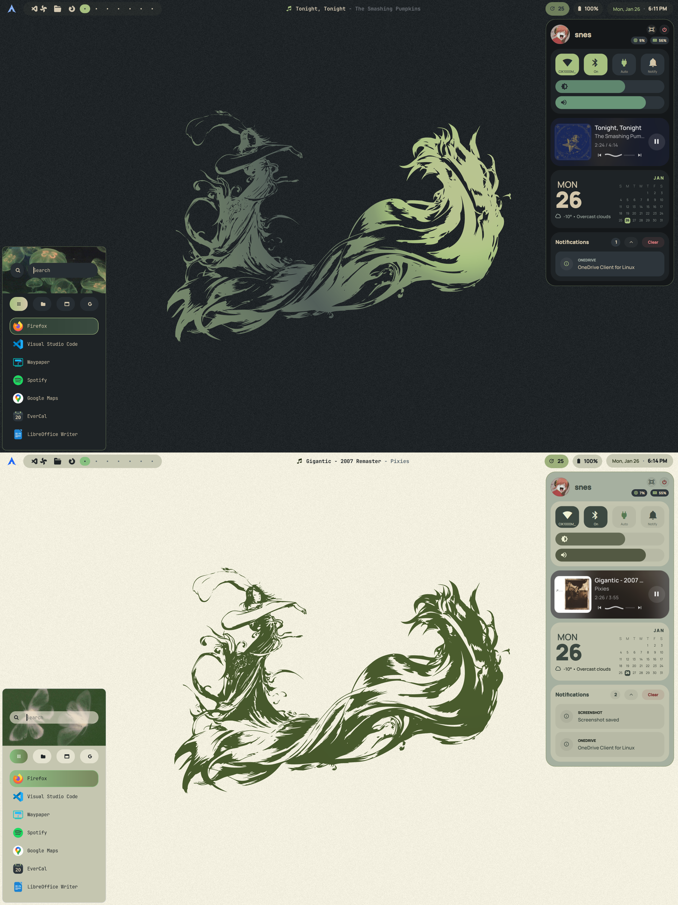
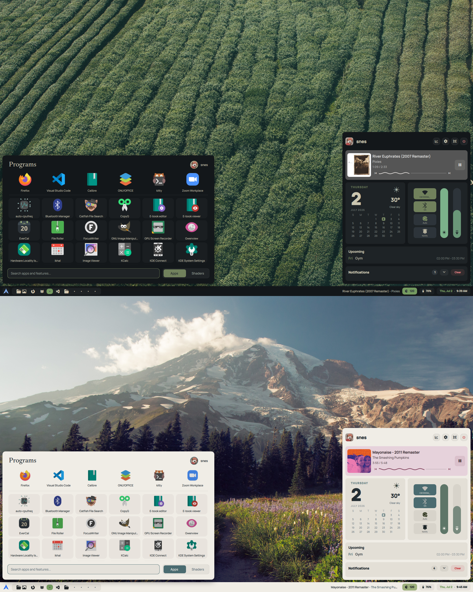
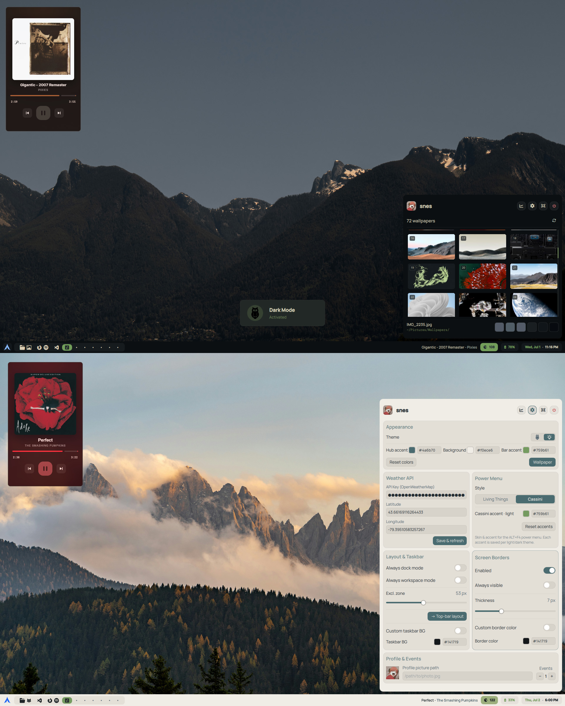
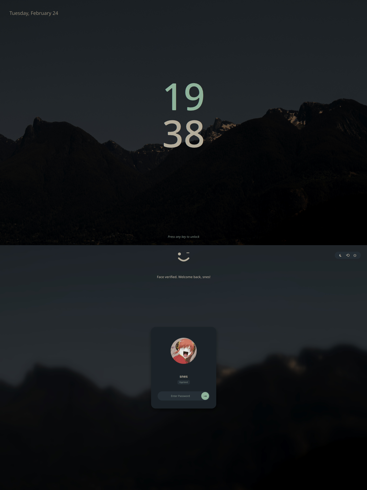
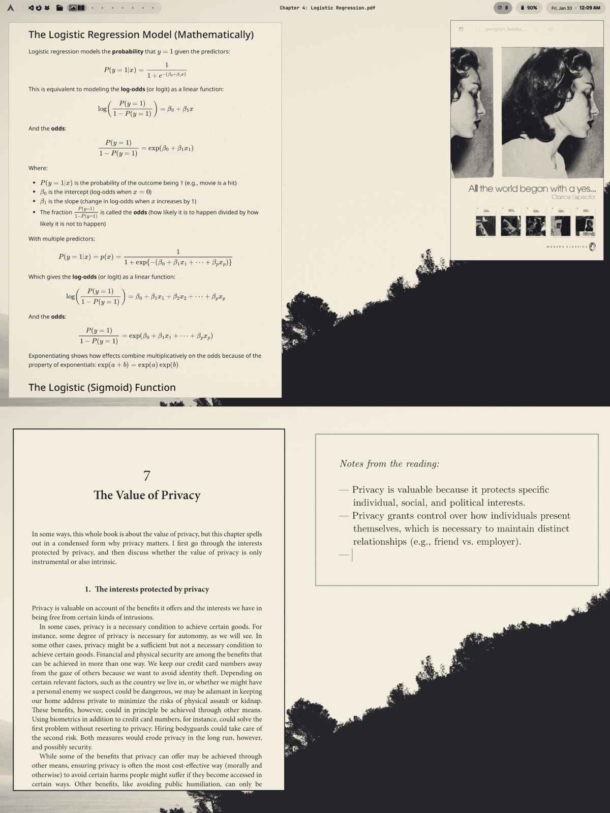
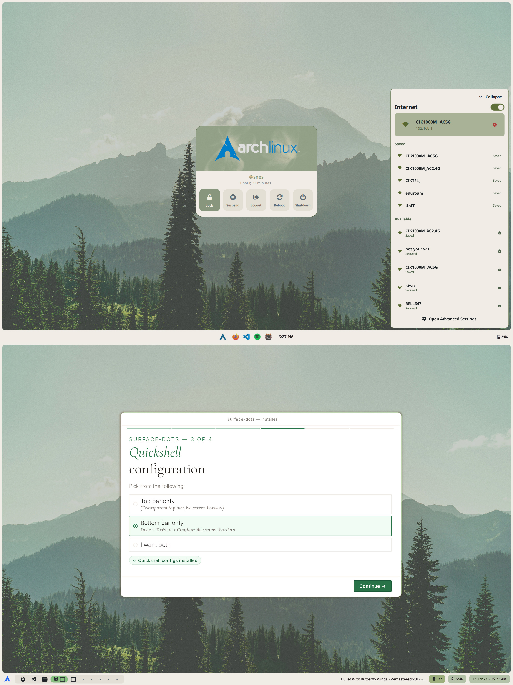
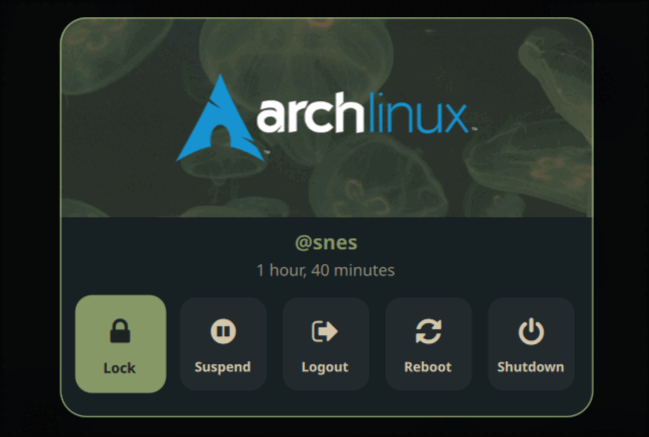
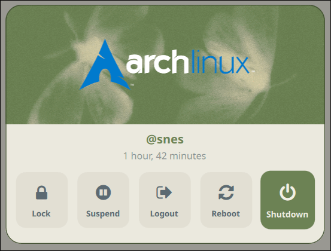

# surface-dots

Personal dotfiles + UI setup for my **Surface Laptop 4 (AMD)** running **Hyprland**.
Also, please check out my calendar app: [Evercal](https://github.com/snes19xx/EverCal)

---

## Table of contents

- [Screenshots](#screenshots)
- [Dependencies](#dependencies)
- [Installation](#Installation)
- [Hyprland](#hyprland)
- [Shaders](#shaders)
- [Desktop Layouts](#desktop-layouts)
- [Quickshell Hub](#quickshell-hub)
- [Power menu](#power-menu)
- [Wifi menu](#wifi-menu)
- [Themes](#themes)
- [Pixel sddm theme](#pixel-sddm-theme)
- [Firefox Customizations](#firefox-customizations)
- [Utilities](#utilities-1)
- [Credits & acknowledgements](#credits--acknowledgements)
- [Media sources](#media-sources)
- [FAQs](#faqs)

---

## Screenshots

<div align="center">
<div style="display:flex; justify-content:center; gap:10px;">
  
  
  
</div>
<p><i>Desktop Layouts</i></p>

<br/>

<div style="display:flex; justify-content:center; gap:10px;">
  
  
  
</div>
<p><i>Lockscreen, Reading Mode, Other system components</i></p>

</div>

## Dependencies

<table>
<tr>
<td valign="top">

### Core & System

- quickshell
- hyprland
- hypridle
- hyprlock
- hyprshade
- hyprland-plugins
- xdg-utils
- xdg-desktop-portal-hyprland
- xdg-desktop-portal-kde
- xdg-desktop-portal-gtk
- polkit-gnome
- sddm
- networkmanager
- bluez, blueman

</td>
<td valign="top">

### UI & Theming

- dunst
- awww
- waypaper-git
- rofi
- kitty
- firefox
- colorreload-gtk-module
- qt6ct
- kvantum
- papirus-icon-theme
- ttf-manrope
- ttf-nerd-fonts-symbols
- Iosevka Nerd Font Mono
- inter-font
- volantes_cursors

</td>
<td valign="top">

### Utilities

- grim, slurp, swappy, grimblast
- pamixer
- pulseaudio-utils
- playerctl
- brightnessctl
- libnotify
- wl-clipboard
- vdirsyncer
- khal
- [EverCal](https://github.com/snes19xx/EverCal)
- xdg-utils
- curl, jq
- auto-cpufreq
- howdy-git (optional)
</td>
</tr>
</table>

---

> [!CAUTION]
> Layout geometry is hardcoded for 3:2 high-resolution display. Deviation in aspect ratio or pixel density will result in misalignment or things looking too big or small. Please reconfigure values accordingly.

## Installation

A GUI installer is included for installing surface-dots.

Installer [source code](./.source_codes/installer_src) and [documentation](./.source_codes/installer_src/installer_readme.md)

> [!IMPORTANT]
>
> - If the installer fails to launch, you may need the WebKitGTK runtime libraries
> - You must have a polkit authentication agent installed and running before you run the installer to prompt you for your sudo password

```bash
# arch:
sudo pacman -S webkit2gtk-4.1
# debian:
sudo apt install libwebkit2gtk-4.1-0
# fedora:
sudo dnf install webkit2gtk4.1
```

##### Installation Steps

1. Clone the repository
2. Make the precompiled installer executable
3. Launch the installer

```bash
git clone https://github.com/snes19xx/surface-dots
cd surface-dots
chmod +x surface-dots-installer
./surface-dots-installer
```

##### Note

- The installer does **not** install dependencies. Install any required packages through your distribution’s package manager before running it.

- Some files from `.config` are intentionally skipped by the installer. If you need anything not included in the automated install, please manually copy the files from git clone.

- The installer has only been tested on Arch Linux with the glibc versions used by Arch. Compatibility with other distributions is unknown. If you test it on another distribution, feel free to report whether it works or fails.

## Hyprland

<details>
  <summary><strong>Keybindings</strong></summary>

### Apps

- `SUPER + Q` → terminal (`kitty`)
- `SUPER + E` → file manager (`thunar`)
- `SUPER + R` → rofi
- `SUPER + B` → firefox
- `SUPER + D` → reading mode
- `SUPER + N` → night light
- `SUPER + S` → my custom ocr app

### Window actions

- `SUPER + SPACE` → toggle hub on or off
- `SUPER + X` → kill active window
- `SUPER + F` → toggle floating (simple)
- `SUPER + ALT + F` → toggle floating **and** set size `900x600` + center
- `SUPER + M` → fullscreen
- `SUPER + P` → pseudotile
- `SUPER + UP` → togglesplit
- `SUPER + DOWN` → togglesplit

### Exit

- `ALT + F4` → Power menu
- `SUPER + ALT + F4` → exit Hyprland

### Focus (arrow keys)

- `SUPER + Left/Right` → move focus horizontally
- `SUPER + UP/Down` → move focus vertically

### Workspaces

- `SUPER + 1..0` → workspace `1..10`
- `SUPER + SHIFT + 1..0` → move active window to workspace `1..10`
- `SUPER + mouse wheel` → next/prev workspace
- `SUPER + G` → toggle group
- `SUPER+CTRL+LEFT/RIGHT` → move across grouped windows

### Scratchpad (“special workspace”)

- `SUPER + H` → toggle special workspace `magic`
- `SUPER + SHIFT + S` → move active window to `special:magic`

### Mouse (window move/resize)

- `SUPER + LMB` → move window
- `SUPER + RMB` → resize window

### Screenshots

- `Print` → Screen snip
- `SUPER + Print` <i>or</i> `SUPER + O` → Capture screen
- `SUPER + SHIFT + Print` → Window capture

</details>

---

## Shaders

Shaders are integral part of my setup, I find them fun.

- All shaders located at `~/.config/hypr/shaders/` and use [hyprshade](https://github.com/loqusion/hyprshade)
- shaders can be accessed and toggled through rofi start menu (only in taskbar mode)

OR:

```bash
# activate with:
hyprshade on <shader_name.glsl>
# deactivate with:
hyprshade off
```

#### Reading Mode

A shader-based reading mode to mimic an e-ink reader.

- Toggle with `SUPER + D` or `~/.config/hypr/shaders/reading_mode.sh`
- Automatically disables animations, shadows, and blur
- Custom GLSL shader with e-ink-like color reproduction
- Warm cream paper tone and soft charcoal blacks for reduced contrast
- Fine paper grain -like texture

#### Other shaders

**Ranked from Useful to completely Useless:**

1. **`main.glsl`** – _main shader to improve my display (activates on startup through hyprland exec)_
2. **`night.glsl`** – _my main night-light mode shader_ (toggle with `SUPER + N`)
3. **`outdoor.gls`** – _for maximum outdoor useability_
4. **`cinema.glsl`** – _for media consumption_
5. **`soft.glsl`** – _soft, muted textures_
6. **`matte.glsl`** – _anti-glare, matte_
7. **`IMB5151.glsl`** – _simulates vintage IBM 3278 / 5151 monitors_
8. **`fuji_acros.glsl`** – _simulates fujifilm acros_
9. **`crt_mode.glsl`** – _simulates a crt monitor_
10. **`vhs.glsl`** – _simulates vhs_
11. **`gameboy.glsl`** – _simulates a gameboy screen_
12. **`clarity_inefficient.glsl`** – _early version of my main shader inefficient but looks better_
13. **`focus.glsl`** – _party trick_
14. **`night_vision.glsl`** – _simulates night_vision_

## Desktop Layouts

Two desktop layouts are available depending on how you want the bar positioned.

Use the **top bar layout**:

```bash
qs -c top-bar
```

Use the **taskbar layout**:

```bash
qs -c task-bar
```

Both layouts (mostly) reuse the same core components but behave differently depending on mode.

> _The layouts are implemented as separate shells rather than a single unified shell. The project originally started as a simple calendar widget for my Google Calendar events. As more components were added over time, it evolved without a strict overall layout plan. Consolidating everything into a single shell would require significant code edits which I don't want to do atm_

#### Taskbar Mode Behavior

Taskbar mode has additional desktop components and layout changes:

- `desktop/ScreenBorders.qml`
- `dock/Drawer.qml`

##### Default state (no active windows)

When the session starts or when no windows are open:

- ScreenBorders wrap around the display edges.
- The taskbar switches to dock mode.
- The center of the dock contains a quickshell app drawer: `dock/Drawer.qml`

##### When a window becomes active

As soon as a window opens:

- ScreenBorders hide
- The taskbar switches to workspace mode
  - The taskbar in this state behaves similarly to the regular bar used in top-bar mode, except it appears at the bottom of the screen.
  - The launcher drawer switches to rofi instead of the Quickshell drawer.

##### Other taskbar-specific changes

- The rofi (start) menu is wider and contains `shaders`(inspired by windows 10 start menu)
- The Hub media card derives its background colors from album art palette colors, instead of using blurred album artwork.
- Upcoming events are no longer displayed inside `CalendarsWeatherCard.qml` and have a dedicated card
  `hub/Events.qml`. By default, the next upcoming event is shown until it ends. Multiple events can be added to the list by increasing the loop count in the file.
- <strong>Theme switching</strong> also differs between layouts:
  - <u>Taskbar mode</u>: the Hub header has a theme toggle button (dark/light).
  - <u>Topbar mode</u>: right-clicking the Arch glyph launcher icon toggles the theme.
    Both modes use the same theme script just located at:

  ```bash
  # in top bar mode:
  bash ~/config/quickshell/top-bar/bar/theme-mode.sh dark|light
  ```

  ```bash
  # in task bar mode:
  bash ~/config/quickshell/task-bar/utils/theme-mode.sh dark|light
  ```

- Changing colors is generally easier in **Taskbar mode**, as most styling is handled through the dynamic theme system in `lib/ThemeEngine.qml`. Some components still use the older `theme.js` configuration, and a few define their own colors internally, so theme behavior is still not completely unified.

<details>
  
  <summary><strong><u>Expand for Topbar/Taskbar components</u></strong></summary>

### Workspaces

Clicking a workspace pill runs:

```
hyprctl dispatch workspace <id>
```

### Updates

Updates are hardcoded for `archlinux` if you are using a different distro please replace:

```qml
// replace this snippet
sh(`
            if [ -e /var/lib/pacman/db.lck ]; then
                cat /tmp/qs_updates_count 2>/dev/null || echo 0
                exit 0
            fi
            n=$(checkupdates 2>/dev/null | wc -l)
            echo "$n" | tee /tmp/qs_updates_count
        `)
```

with a poller for your distro, for example `debian`:

```qml
// replacement snippet:
sh(`
            # apt list --upgradable does not lock the database, so we skip the lock check
            n=$(apt list --upgradable 2>/dev/null | grep -v 'Listing...' | wc -l)
            echo "$n" | tee /tmp/qs_updates_count
        `)
```

Clicking the updates pill runs:

```bash
kitty -e bash -lc "sudo pacman -Syu"
```

with this line in `Taskbar.qml` (_line 932_) and `Bar.qml`(_line 595_):

```qml
command: ["kitty", "-e", "bash", "-lc", "sudo pacman -Syu"]
```

please replace this line with your package manager's update/upgrade command

### Date and Clock

- Pressing the clock emits a `requestHubToggle()` signal used to open or close the hub.
- Pressing **Esc** or clicking outside the hub closes it.

</details>

# Quickshell Hub

The hub is named 'snes-hub` with

```qml
// in HubWindow.qml (line 78 in task-bar and line 68 in top-bar):
WlrLayershell.namespace: "snes-hub"
```

This is the main control/notification center.
The hub is opened by:

- Clicking the **date/clock module** in the bar
- Pressing **SUPER + SPACE** through a Hyprland keybinding

It is rendered as a **wlr-layershell overlay** designed to stay out of the way and close quickly. The UI is composed of reusable components so cards can be added, removed, or restyled without rewriting the entire hub.

If you want a lightweight fallback, an earlier **AGS** version is available in `.config/ags/`.

<details>
  <summary><strong><u>EXPAND FOR INDIVIDUAL COMPONENTS</u></strong></summary>

### Header

- Profile icon and username
- RAM and CPU usage indicators (only in topbar mode)
- Screenshot button (runs capture script and closes the hub)
- Power button
- Theme toggle button (taskbar mode)

---

### Power Options

A compact power grid expands **inside the header**.

Open it by:

- Clicking the power button
- Pressing the `p` key

Keyboard navigation:

- Arrow keys / Tab to move
- Enter to activate
- Esc to close

---

### Buttons and Sliders

- `Wi-Fi toggle` with SSID readout (right-click opens the Wi-Fi module)
- `Bluetooth toggle` with connected device status
- `Performance profile button` (cycles profiles through `auto-cpufreq`, right click toggles battery health card)
- `DND toggle` (dunst)
- `Volume and brightness sliders` (`pactl` and `brightnessctl`)

---

### Battery Health

The battery health card shows RAM and CPU usage in Taskbar mode.

Polled using:

```
upower -i /org/freedesktop/UPower/devices/battery_BAT1
```

Displayed information:

- Health (capacity %)
- Current charge %
- Charge cycles
- Energy (full / design)
- Time remaining (when available)
- Charging state

> NOTE  
> If your battery device is not `battery_BAT1`, update the device path in `BatteryHealthCard.qml`.

---

### Media Card (MPRIS)

The hub includes an **MPRIS media card**.

- Appears only when media is playing
- Clicking it launches the external **Now Playing widget** and closes the hub
- Resets its internal state when track metadata changes

Some browser content (like YouTube) can behave inconsistently depending on how the browser exposes MPRIS.

In taskbar mode, the media card uses colors extracted from album art instead of blurred artwork backgrounds.

---

### Now Playing (Flutter)

This is a separate Flutter desktop widget managed through Hyprland window rules.

Behavior:

- Window resizing is disabled (`setResizable(false)`)
- Esc closes the widget
- Theme colors are generated from album artwork using `palette_generator`

> NOTE  
> You may need to make the now_playing binary executable and change the path to it in MediaCard.qml

---

### Calendar, Weather and Events

The hub includes a calendar and weather card using a JSON-based weather script.

Calendar events are synced from **Google Calendar** using:

- `vdirsyncer`
- `khal`

Events are displayed in a dedicated Events card in Taskbar mode instead of inside `CalendarsWeatherCard.qml`.

The next upcoming event remains visible until it finishes. Multiple events can be configured inside:

```
hub/Events.qml
```

<details>
<summary><strong>Google Calendar sync (vdirsyncer + khal)</strong></summary>

Recommended installation method (avoids system Python packaging issues):

```bash
sudo pacman -S --needed python-pipx
```

```bash
pipx install "vdirsyncer[google]"
```

If both a system and pipx version of vdirsyncer exist, remove the system package and ensure `~/.local/bin` appears earlier in `PATH`.

### Setup

Create the required directories:

```bash
mkdir -p ~/.config/vdirsyncer/status ~/.config/vdirsyncer/tokens
mkdir -p ~/.local/share/vdirsyncer/calendars
```

Example configuration values:

```
token_file = "~/.config/vdirsyncer/tokens/google_calendar"
type = "google_calendar"
client_id / client_secret
```

Calendar files are stored in:

```
~/.local/share/vdirsyncer/calendars/*
```

Khal reads `.ics` files from this location.

### Notes

- The **CalDAV API** must be enabled in Google Cloud.
- If OAuth consent is in testing mode, add yourself as a **test user**.
- If you receive “token obtained but Not Found”, enable calendars at:

https://calendar.google.com/calendar/syncselect

### Sync and test

```bash
vdirsyncer discover
vdirsyncer sync
khal list now 7d
```

</details>

---

### Notifications

- Clicking a notification dismisses it
- Uses dunst (`dunstctl`) as the backend
- Collapsed by default when the media card is active
- Can be expanded with the expand button

---

</details>

## Power menu

<div align="center">
  <table>
    <tr>
      <td>
        
      </td>
      <td>
        
      </td>
    </tr>
  </table>
</div>

wlr-layershell power menu overlay (separate from the hub header menu). Toggled with ALT+F4
**Run**

```bash
# in Topbar mode:
quickshell -p ~/.config/quickshell/top-bar/bar/PowerMenu.qml
```

```bash
# in Taskbar mode:
quickshell -p ~/.config/quickshell/task-bar/utils/PowerMenu.qml
```

## Wifi menu

Standalone network manager applet located at lib/WifiMenu.qml. With both (light/dark) theme.

- Trigger: Right-click the Wi-Fi button in the Hub.
- or run: `quickshell -p ~/<pathto>lib/Wifimenu.qml`

> [!WARNING]
> You cannot connect to enterprise access points (for now), I haven't had the time to fix it yet

## OSDs

Custom on-screen displays for:

- Volume
- Brightness
- Various system modes (Dark, Light, Reading Mode, etc.)

## Themes

##### GTK:

I use a modified version of Fausto-Korpsvart's Everforest gtk theme. The installer automatically copies it to the required directory for the theme toggle script to use it.

##### Qt / Kvantum

Kvantum theme files are located in:
`.config/Kvantum`

Additional related configuration files:
.config/qt6ct  
.config/color-schemes

Use _Kvantum Manager_ to install and apply the Kvantum theme.

## Pixel sddm theme

[Note: I am using qt5, you may need qt5 dependencies alongside qt6]

```bash
sudo pacman -S qt6-5compat qt6-svg qqc2-desktop-style inter-font ttf-nerd-fonts-symbols
```

The installer installs the theme and writes to conf.d automatically. It will however prompt you for password authorization via pkexec.

- For Manual install:
  - move the contents of sddm/theme folder to `/usr/share/sddm/themes/` (create the dir if it doesn't exist yet) and:

    ```bash
    sudo mkdir -p /etc/sddm.conf.d
    echo -e "[Theme]\nCurrent=pixel" | sudo tee /etc/sddm.conf.d/theme.conf
    ```

## Firefox Customizations

<div align="center">
<div style="display:flex; justify-content:center; gap:10px;">
  
  
</div>
</div>
Included in this repo are `start.html`:

- **`start.html` (Stellarium):** A local new tab page. It tracks real-time weather, lunar phases, and celestial data. The background shifts procedurally between a daytime solar system and a nighttime starfield based on your local time.
- **`/chrome/userChrome.css`:** A custom stylesheet that overrides the default Firefox interface.
  <i>(These customizations work in windows or other os as well)</i>

Firefox doesn't really want you to use local html as a new tab page so

- Move autoconfig.js to Firefox defaults/pref/ (e.g. /usr/lib/firefox/defaults/pref/)
- Edit mozilla.cfg (repo path: .config/firefox/mozilla.cfg) and set your file path
- Move mozilla.cfg to the Firefox install directory root (e.g. /usr/lib/firefox/)

<details>
<summary><strong>Expand for instructions to install custom usercss:</strong></summary>

##### 1. Enable Stylesheets in Firefox

1. Open Firefox and enter `about:config` in the URL bar.
2. Accept the risk warning.
3. Search for `toolkit.legacyUserProfileCustomizations.stylesheets`.
4. Double-click to set the value to `true`.

##### 2. Locate Your Active Profile

1. `about:profiles`.
2. Find the profile box that states: <i>"This is the profile in use and it cannot be deleted."</i>
3. Copy the path listed under **Root Directory** (e.g., `/home/username/.mozilla/firefox/xxxxxxxx.default-release`).

##### 3. Install the Files

- copy the userChrome.css in the chrome folder (create it if it doesn't exist or move the chrome folder from the repo)
</details>

## Utilities

Utilities include the following:

- `crt_gen.py` a script to add crt like filters to an image (works best with images that aren't too bright or too dark)
- `figures.py` script to generate nice fun mathematical illustrations
- `SR4.icm` Color profile for the display of the Surface Laptop 4. Import it in KDE Plasma to get Windows-like color calibration.
- Fonts I like and use often

## Credits & Acknowledgements

- [Everforest-GTK-Theme](https://github.com/Fausto-Korpsvart/Everforest-GTK-Theme) by Fausto-Korpsvart
- Topbar mode Rofi themes loosely based on @adi1090x's [type 7](https://github.com/adi1090x/rofi/blob/master/previews/launchers/type-7/5.png)
- `Pixeldots.qml` in sddm theme based on @mahaveergurjar's [Pixeldots](https://github.com/mahaveergurjar/sddm/tree/pixel)
- Colors: Modified from https://github.com/sainnhe/everforest
- VScode theme: Modified from Andrei Lucaci's [Everforest pro theme](https://marketplace.visualstudio.com/items?itemName=AndreiLucaci.everforest-pro)
- [Hyprshade](https://github.com/loqusion/hyprshade)
- Kvantum theme based on [materia-everforest-kvantum](https://github.com/binEpilo/materia-everforest-kvantum)
- Dave Hoskins for [Hash without Sine](https://www.shadertoy.com/view/4djSRW)
- Most svgs are from [https://www.svgrepo.com/](https://www.svgrepo.com/) , I made some myself
- linux-surface project: https://github.com/linux-surface/linux-surface
- Thorium: https://thorium.rocks/ for the background visualizations in firefox custom new tab
- My design inspiration comes mainly from : [Microsoft design](https://microsoft.design/), [Material design](https://m3.material.io/blog/building-with-m3-expressive) and [calla](https://github.com/Stardust-kyun/calla). The typography and UI design used in the installer are my own original work, which I’ve also used in several of my other projects, including my website.

## Media Sources

1. Photo by fffunction studio on [Unsplash](https://unsplash.com/photos/green-trees-near-mountains-during-daytime-IrWgzQ_Y_zg)
2. Photo by Brian McGowan on [Unsplash](https://unsplash.com/photos/astronaut-in-white-suit-in-grayscale-photography-I0fDR8xtApA)
3. Photo by Mimicry Hu on [Unsplash](https://unsplash.com/photos/aerial-photography-of-persons-on-plant-field-24tsXm7qGQE)
4. Photo by Bailey Zindel on [Unsplash](https://unsplash.com/photos/body-of-water-surrounded-by-trees-NRQV-hBF10M)
5. Photo by Jay Yu on [Unsplash](https://unsplash.com/photos/silhouette-of-trees-under-starry-night-atiSW3NHtUM)
6. Photo by Ben Dutton on [Unsplash](https://unsplash.com/photos/green-trees-FKrcPEZfoNU)
7. Photo by Richard Rhee on [Flickr](https://www.flickr.com/photos/rcrhee/15167206848/)
8. Photo by Cedric Chambaz on [Flickr](https://www.flickr.com/photos/cchambaz/2391578535/in/gallery-195423583@N07-72157720611385337/)
9. Photo by temo Berishvili on [Unsplash](https://www.pexels.com/photo/herd-of-animals-on-grass-field-near-mountains-1574843/)
10. Photo by Lucas Pezeta on [Unsplash](https://www.pexels.com/photo/cows-grazing-on-field-2331478/)
11. `media/wallpaper/surface_defaults` wallpapers are from microsoft
12. All Rofi pictures were pulled from Pinterest; I don’t know the original owners.

[OC]

`media/wallpaper`
Collection of pictures taken by me, some edited/created by me and a bunch of them are just screencaps from the monogatari series:

- Lucina wallpaper from [Fire Emblem Awekening Artbook](https://www.amazon.ca/Art-Fire-Emblem-Awakening-ebook/dp/B01J1XIC2O)
- Final Fantasy logos: by [Yoshitaka Amano](https://en.yoshitaka-amano.com/#/)
- Monogatari wallpapers are edited from the scans of [Monogatari Series 10th Anniversary Illustration Works Art Book](https://www.ebay.ca/itm/403993406564)
- [15,16 and 17].png are from [AhogeDesu](https://imgur.com/gallery/utamonogatari-styled-heroines-DH4ca2m)
- untitled.png from nanora on [artstation](https://www.artstation.com/nanora)

#### <span style="color:#a41d1d">[Reuse Note:]</span>

Feel free to copy/steal whatever you want as long as you cite me and more importantly the listed media sources in the credits/references where applicable.

## FAQs

**Q: Will this run on a distro other than Arch Linux?** <br>
_A: I'm not sure about the installer but as long as you have the dependencies I don't see why it wouldn't._

**Q: Can I use this setup with another compositor or desktop environment?** <br>
_A: Yes. Most features, including Quickshell, will work correctly (as long as you're on wayland). Shaders are the only exception. However, some features exclusively rely on hyprland's ipcs, for best experience please use with hyprland_

**Q: Why use Flutter for the "Now Playing" widget?** <br>
_A: It was one of my first projects while learning Flutter, which explains the older dependencies. Behind the Material Design frontend, it is just a standard MPRIS controller._

**Q: How does the face unlock animation work?** <br>
_A: It assumes the authentication was successful by default. You may need to adjust the timer in `main.qml` to get the timing right for a realistic effect. It does properly recognize authentication failures and timeouts._

**Q: Why are there multiple app drawers (including the top-bar Rofi drawers)?**<br>
_A: I am currently experimenting with different designs and layouts. My plan is to write a custom app drawer from scratch in rust with live tiles similar to Windows 10. I want it to feel distinctly native to Linux rather than acting as a cheap copy of the Windows Metro UI._

**Q: How do I enable or disable screen borders?** <br>
_A: (Only in taskbar mode) follow the instruction in shell.qml_

**Q: Components are misaligned in the hub. How do I fix them?** <br>
_A: You can correct alignment by adding padding (left, right, up, down), adjusting spacing, or using the `translate` function. For example, to move weather in `CalendarWeather` card to the right:_

```qml
// Right: Weather
      ColumnLayout {
        Layout.alignment: Qt.AlignTop | Qt.AlignRight
        Layout.preferredWidth: 110

        /* increase to move right, decrease (values can be negatives too) to move to the left */
        transform: Translate { x: 5 }  // <--- add this
```

**Q: The taskbar is covering windows at the bottom of the screen. How do I fix this?** <br>
_A: Decrease the layer exclusive zone in `Taskbar.qml` or increase the gaps in Hyprland config._

```qml
// desktop/Taskbar.qml
    WlrLayershell.exclusiveZone: 47 // <-- change this
```

**Q: Will you make a settings app to configure things instead of requiring file edits?** <br>
_A: Yes, that is the plan. I do not have a strict timeline yet because there's so much spaghetti code_

**Q: Can I use the top-bar Rofi on the taskbar, or vice versa?** <br>
_A: Yes. You just need to edit the path to the launcher script in your Hyprland configuration and update the on-click action within the launcher component for the respective bars._

**Q: The theme switcher is not applying my GTK or Qt themes. How do I fix it?** <br>
_A: First, make sure the script has executable permissions. Next, verify the theme files exist and match the names referenced in the script. Finally, run the script directly from the terminal to check for specific error messages abd fix them one by one._

<div style="text-align:center;">
  <i>If you have any other questions, please start an issue. I'd be more than happy to answer it for you.</i>
</div>
